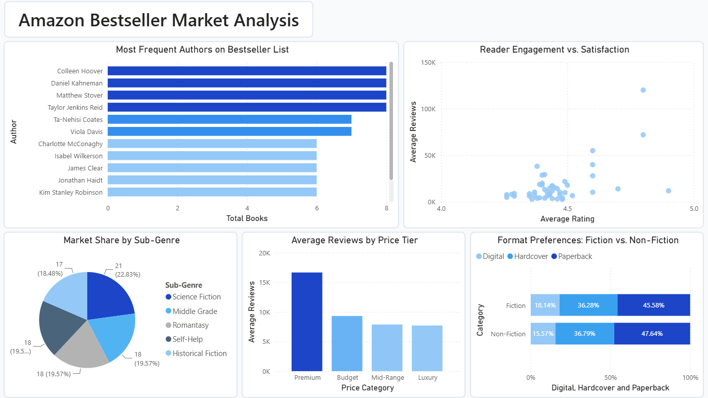

# Amazon Bestselling Books Analysis: SQL & Power BI Case Study


## Project Overview 
This data analytics project explores Amazon's bestseller data to uncover actionable insights for publishers and authors. Using **PostgreSQL** for data modeling and aggregation, and **Power BI** for dashboard design, this project identifies high-potential genres, pricing sweet spots, format distribution strategies, and customer satisfaction gaps.

Check out the data source on Kaggle: [Amazon BestSelling Books Dataset (500 Books)](https://www.kaggle.com/datasets/shambhurajejagadale/amazon-bestselling-books-dataset-500-books)
<br>

---

### Executive Dashboard

<br>

---

## 1. The Business Task & Problem
A hypothetical book publisher wants to enter the highly competitive Amazon marketplace with a new release. However, they face several critical uncertainties:
* **Market Entry:** Which sub-genres are high-volume but currently underserved?
* **Author Strategy:** Is the bestseller landscape dominated by a few repeat giant authors, or is there room for new entrants?
* **Pricing Strategy:** What price tier maximizes reader engagement (review volume) without sacrificing perceived quality?
* **Distribution Strategy:** How do format preferences (Paperback vs. Hardcover vs. Digital) differ between Fiction and Non-Fiction?

---

## 2. Key Business Questions & SQL Methodology
The project was structured around 5 core business questions, solved using SQL techniques (Aggregations, conditional formatting, and case statements):
  
1. **What is the market demand across different sub-genres?** (Analyzed volume, sum of reviews, and average rating).

**Approach:** Grouped the dataset by `sub_genre` and aggregated total book counts, sum of reviews (to measure engagement volume), and average rating (to check baseline satisfaction).

```sql
SELECT 
    sub_genre, 
    COUNT(*) AS total_count, 
    SUM(reviews) AS sum_reviews, 
    ROUND(AVG(rating), 2) AS avg_rating
FROM bestsellers
GROUP BY sub_genre
ORDER BY total_count DESC;
```
<br>

2. **Who are the repeat brand-name authors?** (Identified authors with multiple bestseller appearances to assess market monopoly).

**Approach:** Aggregated the dataset by `author` to calculate total occurrences (count_books) on the bestseller list, along with their average ratings and pricing.

```sql
SELECT 
    author, 
    COUNT(title) AS count_books, 
    ROUND(AVG(rating), 2) AS avg_rating, 
    ROUND(AVG(price_usd), 2) AS avg_price
FROM bestsellers
GROUP BY author
ORDER BY count_books DESC;
```
<br>

3. **Where are the audience expectation gaps?** (Analyzed the relationship between review volume and average ratings).

**Approach:** Grouped by `sub_genre` and averaged reviews and ratings, plotting the results to find sub-genres with high engagement but comparatively lower ratings.

```sql
SELECT 
    sub_genre, 
    ROUND(AVG(rating), 2) AS avg_rating_sub, 
    ROUND(AVG(reviews)) AS avg_reviews_sub
FROM bestsellers
GROUP BY sub_genre
ORDER BY avg_rating_sub ASC;
```
<br>

4. **What pricing tier drives the highest reader engagement?** (Grouped books into Budget, Mid-Range, Premium, and Luxury tiers).

**Approach:** Applied a `CASE WHEN` statement to segment book prices into four strategic buckets: Budget (<$5), Mid-Range ($5–$9.99), Premium ($10–$19.99), and Luxury (≥$20), then calculated the average reviews for each tier.

```sql
SELECT 
    CASE 
        WHEN price_usd < 5 THEN 'Budget'
        WHEN price_usd BETWEEN 5 AND 9.99 THEN 'Mid-Range'
        WHEN price_usd BETWEEN 10.00 AND 19.99 THEN 'Premium'
        ELSE 'Luxury'
    END AS price_category, 
    COUNT(*) AS book_count, 
    ROUND(AVG(reviews)) AS avg_reviews
FROM bestsellers
GROUP BY price_category
ORDER BY avg_reviews DESC;
```
<br>

5. **How should distribution formats be allocated across categories?** (Built a format pivot table for Fiction vs. Non-Fiction).

**Approach:** Used conditional aggregation `(COUNT(CASE WHEN...))` to build a clean pivot table showing the physical and digital format split across the book categories.

```sql
SELECT 
    category,
    COUNT(CASE WHEN format = 'Paperback' THEN 1 END) AS paperback_count,
    COUNT(CASE WHEN format = 'Hardcover' THEN 1 END) AS hardcover_count,
    COUNT(CASE WHEN format ILIKE '%Kindle%' OR format ILIKE '%Ebook%' THEN 1 END) AS digital_count
FROM bestsellers
GROUP BY category;
```

---

## 3. Data Insights (What the Data Tells Us)

### Market Demand & Audience Gaps
* **Science Fiction Dominance:** **Science Fiction** has the largest overall share of bestsellers at **22.83%** (21 books), followed in a near three-way tie by **Middle Grade**, **Romantasy**, and **Self-Help**, each capturing **19.57%** (18 books) of the bestseller list.
  
* **The High-Engagement Outliers:** The scatter plot reveals massive customer engagement outliers in the high-satisfaction quadrant. The highest-performing sub-genre shows an incredible average rating of **~4.8 stars** and over **120,000 average reviews**.
  
* **The "Expectation Gap" Opportunity:** Multiple sub-genres cluster in the **4.3 to 4.4-star rating zone** still has around **25,000 to 40,000 average reviews**. This represents an opportunity: readers are highly motivated to buy and review these genres, but existing books are failing to satisfy them.

### Pricing & Brand Dynamics
* **The Premium Sweet Spot:** Books priced in the **Premium ($10.00 - $19.99)** tier drive the highest average reviews per book, suggesting that readers are highly engaged and associate this price point with quality.
  
* **The Bestseller Monopoly:** The top of the bestseller list is heavily guarded by powerful repeat authors. Giants like **Colleen Hoover, Daniel Kahneman, Matthew Stover, and Taylor Jenkins Reid** lead the pack, each securing **8 unique bestseller appearances**. For a new publisher, this indicates that leveraging an author's personal brand or establishing strong credibility is important to competing at the very top of the charts.

### Format Preferences
* **Paperback Dominance:** Paperback is the most preferred format for both **Non-Fiction (47.64%)** and **Fiction (45.58%)** readers.
  
* **Hardcover Consistency:** Hardcovers maintain a rock-solid secondary position, holding **~36.8%** for Non-Fiction and **36.28%** for Fiction.
  
* **Digital Limitations:** Digital editions (Kindle/eBooks) capture the smallest slice of bestseller real estate, representing **18.14%** in Fiction and dipping to **15.57%** in Non-Fiction.

---

## 4. Strategic Recommendations
Based on the data, the publisher should execute the following strategy:

### Market Entry – Target the "Underserved" Audience
* **Action:** Avoid launching directly into heavily crowded sub-genres unless backed by a massive marketing budget. Instead, target high-demand sub-genres that sit in the **4.3 to 4.4-star rating zone** (such as the high-volume cluster visible on our scatter plot).
  
* **Rationale:** This "expectation gap" indicates a passionate, highly active buyer base that is routinely buying and reviewing books but rating them lower. Introducing a highly polished, well-edited book in this category allows a new publisher to capture market share.
  
* **Target Audience:** Highly engaged, vocal readers hungry for higher-quality narratives.

---

### Pricing Strategy – Position in the Premium Tier
* **Action:** Price the newly launched title between **$10.00 and $19.99** (the **Premium Tier**).
  
* **Rationale:** The data debunks the myth that cheaper books generate more traction. The **Premium Tier** drives an average of nearly **17,000 reviews per book**, doubling the engagement of the Budget tier. Pricing a book here positions it as a high-quality product in the minds of readers.
  
* **Financial Benefit:** Maximizes profit margins per unit while maximizing organic algorithmic visibility driven by massive customer engagement.

---

### Distribution Model – Execute a "Physical-First" Campaign
* **Action:** Prioritize printing and distributing **Paperbacks (allocating ~45-50% of the inventory budget)** and **Hardcovers (~35%)** as the primary drivers, while launching a companion **Digital (Kindle/eBook) version (~15-18%)** on day one.
  
* **Rationale:** Across both Fiction and Non-Fiction, physical print remains the undisputed king of the Amazon bestseller list, representing over **80% of bestseller slots combined**.
  
* **Operational Strategy:** Use digital editions for cheap, rapid promotional pushes to spike algorithmic ranking, but rely on physical paperback copies to capture sustained, long-term sales volume.

---

### Risk Mitigation – Leverage Co-Authorship or Brand Licensing
* **Action:** To enter the high barrier established by "repeat giant" authors (like Colleen Hoover or Daniel Kahneman, who dominate with up to 8 bestseller entries), seek strategic partnerships.
  
* **Rationale:** The bestseller list has a high barrier to entry because of established reader loyalty. A new publisher can mitigate this risk by:
  1. Collaborating with an established influencer or co-author.
  2. Running a highly structured, community-led pre-launch ARC (Advance Reader Copy) campaign to secure social proof before launch day.

---

## 5. Project Limitations & Data Constraints
* **Survivorship Bias:** The dataset exclusively tracks books that successfully achieved "Bestseller" status. Because it lacks historical performance data on books that *failed* to rank, we do not have a comparison group to prove which factors truly guarantee success. The findings analyze the attributes of success, not the probability of achieving it.
  
* **Absence of Marketing Attribution:** A book's bestseller status is often heavily influenced by external, non-captured variables such as the publisher's marketing budget, social media ad spend, author newsletter size, and offline PR campaigns.

* **Lack of Direct Financial Profitability Data:** While we can analyze price points and unit popularity, the dataset does not capture the cost of goods sold (COGS), printing costs, Amazon's specific royalty splits, or distribution fees. Consequently, "Premium" pricing indicates high *engagement*, but actual *net margin profitability* cannot be fully verified.
